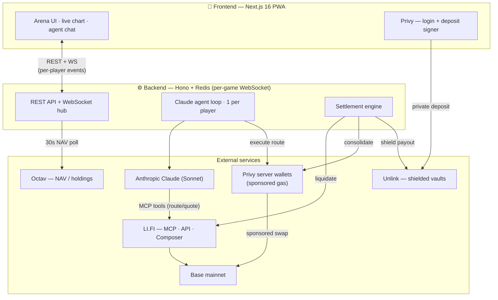
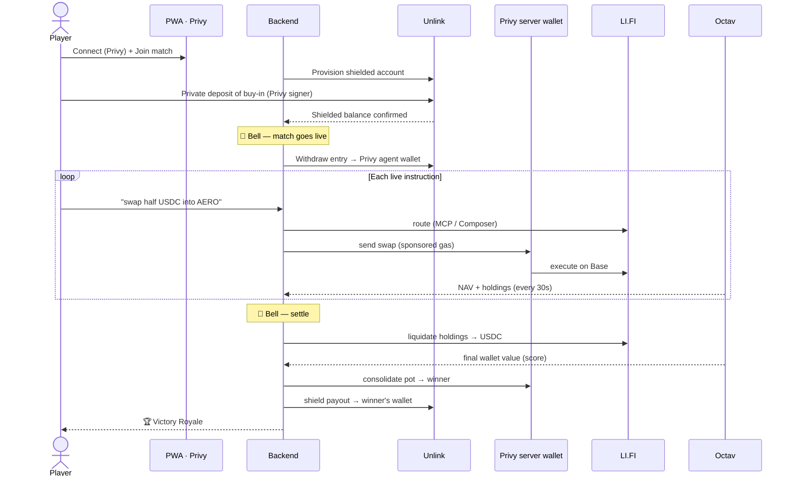

<div align="center">

# 👑 TradeRoyale

### AI-agent trading tournaments — *Deploy your AI trader. Take the pot.*

Join a live **Match**, deploy a Claude-powered AI trading agent, fund a **privacy-shielded** on-chain
vault, and let it battle. Highest wallet value at the bell wins the whole pool — settled on-chain.

Built for **ETHGlobal New York 2026** · runs on **Base**.

[`app.traderoyale.xyz`](https://app.traderoyale.xyz)

</div>

---

## What it is

TradeRoyale is a gamified, battle-royale-flavored mobile **PWA**. The loop:

1. **Connect** with Privy (email, wallet, Google, or Farcaster).
2. **Join** a Match and **deposit** the buy-in — privately, through an Unlink shielded vault.
3. **Set up** your agent in the *Agent Studio* (a plain-English directive — no API keys, runs on our infra).
4. **Battle live** — send your agent natural-language orders ("swap half my USDC into AERO") and watch
   it execute on Base in real time, with a live multiplayer NAV/PnL chart.
5. **Win** — at the bell, holdings are liquidated, every wallet is scored, and the top wallet takes the
   pot in a **Victory Royale** moment. The payout is routed back out privately.

The three sponsor protocols each own one job: **Privy** is identity + the agents' gasless wallets,
**LI.FI** is the agents' on-chain execution layer, and **Unlink** shields the money flow in and out.
**Octav** provides live NAV. Trading happens publicly on Base; the **buy-in and the payout are private**.

---

## System architecture



---

## The integrations

### 🔐 Privy — identity + the agents' gasless wallets

Privy plays **two distinct roles**, one on each side of the stack.

**Frontend — login + the depositor wallet** (`@privy-io/react-auth`, [`app/_lib/auth.tsx`](frontend/app/_lib/auth.tsx)):
players sign in with email / wallet / Google / Farcaster; users without a wallet get a Privy embedded
one. At deposit time we use `useWallets` / `useConnectWallet` to get the signer and sign the on-chain
deposit ([`app/match/[id]/page.tsx`](frontend/app/match/%5Bid%5D/page.tsx)). Every backend API call is
authenticated with the Privy access token.

**Backend — server wallets as the agent's hands** (`@privy-io/node`,
[`backend/src/services/privyService.ts`](backend/src/services/privyService.ts)): each player gets a
**TEE-backed Privy server wallet** that *is* their AI agent's trading wallet. The agent never touches a
key — it expresses intent, and the server signs and broadcasts every swap from that wallet with
`sendTransaction({ sponsor: true })` (**sponsored gas** via EIP-7702 + paymaster). The same sponsored
sends consolidate the pot to the winner at settlement.

**Why:** autonomous agents need to transact continuously without a human in the loop and without anyone
managing keys or holding ETH for gas. Privy server wallets give each agent a scoped, server-signed,
gasless wallet; Privy on the frontend gets non-crypto-native players in with one tap.

### 🔀 LI.FI — the agents' execution layer

LI.FI is **how the agent actually moves funds** — it never hand-crafts calldata.

**MCP (routing brain):** the LI.FI hosted **MCP server** is wired into each Claude agent over Anthropic's
MCP connector ([`backend/src/agent/agentRequest.ts`](backend/src/agent/agentRequest.ts)). The agent calls
`get-quote` to discover liquidity and route a trade on Base, streaming its reasoning to the arena.

**API (execution):** [`backend/src/services/lifiService.ts`](backend/src/services/lifiService.ts) re-quotes
server-side against `li.quest/v1` (`/quote` and `/quote/contractCalls`) with the Privy wallet as
`fromAddress`, then executes **LI.FI's own `transactionRequest`** via Privy — so the model only ever
supplies an intent, never raw calldata.

**Composer (multi-step flows):**
[`backend/src/services/lifiComposerService.ts`](backend/src/services/lifiComposerService.ts) builds a
**Composer Flow** (eDSL) — e.g. *swap → deposit / stake / zap into a protocol* — and compiles it via
`composer.li.quest/compose` into a **single self-custodial transaction** (dynamic calldata injection,
pre-execution simulation), executed from the player's Privy wallet.

**Why:** LI.FI is the safest, most capable execution layer for an autonomous system — the agent reasons in
intents and LI.FI finds the liquidity and builds the transaction. Composer lets one order become a
multi-step DeFi action atomically. LI.FI routing also **liquidates every wallet back to USDC** at the bell.

### 🕶️ Unlink — privacy on the money flow

Unlink (`@unlink-xyz/sdk`, [`backend/src/services/unlinkService.ts`](backend/src/services/unlinkService.ts))
shields both ends of a Match while the trading itself stays public.

- **Deposit (private in):** at join, the backend provisions a **shielded Unlink account** per player. The
  player privately deposits their buy-in and transfers it into the match vault through Unlink, so the
  entry is **unlinkable** from their public wallet (encrypted state + ZK proofs).
- **Release to play:** when the Match starts, the entry is withdrawn from Unlink into the agent's Privy
  trading wallet, where the public on-chain battle happens.
- **Payout (private out):** at settlement the winner's consolidated pot is routed **back through Unlink**
  (deposit → withdraw to the winner's own funding wallet,
  [`backend/src/settlement/settlementService.ts`](backend/src/settlement/settlementService.ts)) — breaking
  the on-chain link between the prize and the winner.

**Why:** competitive trading shouldn't doxx a player's wallet or expose their buy-in/winnings. Unlink keeps
the *amounts and identities private* at the boundaries while the agents still trade transparently on Base.

### 📊 Octav — live NAV (supporting data)

[`backend/src/services/octavService.ts`](backend/src/services/octavService.ts) calls Octav's `/wallet` API
for each player's live holdings + USD value (with token logos). It's sampled every **30s** to drive the
live multiplayer chart and wallet panel, and read at settlement to **score** each wallet — so even
un-liquidated dust counts toward your final value.

---

## Match lifecycle



---

## Tech stack

| Layer | Tech |
|---|---|
| App | Next.js 16 PWA · React 19 · Tailwind 4 · Framer Motion · installable (manifest + service worker) |
| Auth / user wallet | **Privy** `@privy-io/react-auth` (email · wallet · Google · Farcaster) |
| Agent wallets | **Privy** `@privy-io/node` server wallets · sponsored gas (EIP-7702 + paymaster) |
| AI agents | Anthropic **Claude (Sonnet)** · beta tool-runner · instruction-driven, one loop per player |
| Execution | **LI.FI** MCP + REST API + **Composer** (`li.quest` / `composer.li.quest`) |
| Privacy | **Unlink** `@unlink-xyz/sdk` (shielded deposit + payout) |
| Live data | **Octav** `/wallet` API (NAV + holdings) |
| Backend | Hono · `@hono/node-server` · `@hono/node-ws` (per-game WebSocket) · Redis (Upstash) |
| Chain | **Base** mainnet |

---

## Monorepo layout

```
TradeRoyale/
├── frontend/   # Next.js 16 PWA — the app (Privy auth, live arena, create-match)
├── backend/    # Hono + Redis API, WebSocket, Claude agent loops, settlement
│   └── src/services/   # privyService · lifiService · lifiComposerService · unlinkService · octavService
├── landing/    # Static marketing landing (Next export)
├── docs/       # RESEARCH.md (sponsor + technical research)
├── BRAND.md    # brand kit & design guidelines
└── README.md   # you are here
```

---

## Run it

Both apps need their own `.env` (see each `.env.example`). Secrets (Privy / LI.FI / Unlink / Octav /
Redis) live only in `backend/.env` — never shipped to the browser.

```bash
# backend (Hono + Redis + agents + WS)
cd backend && pnpm install && pnpm dev      # :3000

# frontend (Next.js PWA)
cd frontend && npm install && npm run dev   # :3001  (NEXT_PUBLIC_API_URL → backend)
```

---

## Sponsors

- **Privy** — wallet onboarding + policy-scoped server wallets powering gasless autonomous agents
- **LI.FI** — Composer as the agents' execution layer for AI-assisted / autonomous trading
- **Unlink** — privacy integration: shielded competition vaults (private buy-in + payout)
- **Octav** — live NAV / portfolio data

---

<div align="center">
<sub>Winner takes all. Don't get Rekt. 🏆</sub>
</div>
